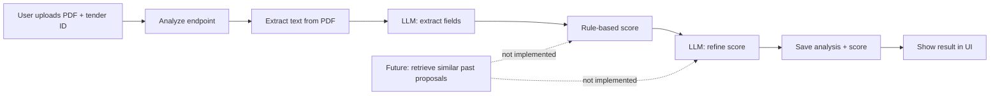

# Yellomind TMS - Simple Platform Explanation

This document explains the Tender Management System (TMS) in simple English so you can present it to your supervisor.

---

## 1) What the platform does

Yellomind TMS helps a team manage the full tender life cycle:

- Store and manage clients.
- Track tenders (appels d'offres) with status and deadlines.
- Prepare and track submissions (soumissions).
- Use a knowledge base to reuse proposal content.
- Analyze tenders with AI (PDF extraction + scoring).
- Plan tasks and deadlines in a calendar.
- View performance reports and KPIs.
- Manage users, roles, and permissions.

---

## 2) High-level architecture

### Frontend (Next.js App Router)
- Folder: `frontend/`
- User interface, pages, and UI components.
- Talks to the backend by REST API.
- Auth uses JWT stored in localStorage and sent in the `Authorization: Bearer ...` header.

### Backend (Express + Sequelize + PostgreSQL)
- Folder: `backend/`
- REST API, auth, database access.
- Uses Sequelize ORM models and controllers (MVC style).
- Handles PDF upload and AI pipeline.

---

## 3) Backend architecture (MVC style)

### Main entry and setup
- `backend/app.js`
  - Express app setup: CORS, Helmet, rate limit, JSON body, cookies.
  - Multer config for PDF upload (`/backend/uploads`).
  - Registers routes under `/api`.
  - Connects to DB and starts server.

### Routing
- `backend/routes/index.js`
  - All API endpoints grouped here.
  - Each route maps to a controller.
  - Uses middleware for auth and permissions.

### Auth and security
- `backend/middlewares/auth.js`
  - `authentifier`: checks JWT token in `Authorization` header.
  - `autoriser`: checks permissions inside the token.
  - `adminSeulement`: only Admin role can proceed.

- `backend/controllers/authController.js`
  - `login`: validates user, creates access token, creates refresh token in DB.
  - `refresh`: gives new access token using refresh cookie.
  - `logout`: revokes refresh token and clears cookie.

### Controllers (API logic)
- `backend/controllers/clientController.js`
  - CRUD for clients (list, detail, create, update, soft delete).
- `backend/controllers/tenderController.js`
  - CRUD for tenders (status, deadline, budget, etc).
- `backend/controllers/submissionController.js`
  - CRUD for submissions (status, result, score).
- `backend/controllers/knowledgeController.js`
  - CRUD for knowledge base items, plus `use` to increase usage count.
- `backend/controllers/planningController.js`
  - CRUD for planning events (calendar), SQL-based queries.
- `backend/controllers/statsController.js`
  - Dashboard KPIs and reports data.
- `backend/controllers/utilisateurController.js`
  - CRUD for users (Admin only for write).
- `backend/controllers/aiController.js`
  - Full AI pipeline (PDF -> extraction -> score -> DB storage).

### Models (DB tables)
- `backend/models/Utilisateur.js` - user profile, hashed password.
- `backend/models/Role.js`, `Permission.js`, `Session.js` - auth and access control.
- `backend/models/Client.js` - client companies.
- `backend/models/Tender.js` - tenders (status, deadline, budget).
- `backend/models/Submission.js` - submissions (status, result, score).
- `backend/models/KnowledgeItem.js` - reusable content.
- `backend/models/TenderAiAnalysis.js` - AI extraction results.
- `backend/models/TenderScore.js` - AI score for each tender.

### Services (AI helpers)
- `backend/services/pdfService.js`
  - Extract raw text from a PDF and clean temp files.
- `backend/services/extractionService.js`
  - LLM call to extract structured data from the PDF text.
- `backend/services/scoringService.js`
  - Hybrid scoring: rule-based pre-score + LLM refinement.
- `backend/services/openrouterClient.js`
  - OpenRouter client for chat and embeddings.
- `backend/config/companyProfile.js`
  - Static profile of the company (used for AI scoring).

---

## 4) Frontend architecture

### App structure
- `frontend/app/`
  - `layout.js`: global layout and fonts.
  - `page.js`: login page.
  - `(main)/layout.js`: app shell layout (sidebar + topbar), role-based access.

### Main pages (what each page does)
- `frontend/app/(main)/dashboard/page.js`
  - KPI cards, pipeline stats, recent tenders, deadline alerts.
- `frontend/app/(main)/clients/page.js`
  - Client list and CRUD form (modal).
- `frontend/app/(main)/tenders/page.js`
  - Tender list, status filters, CRUD form.
- `frontend/app/(main)/submissions/page.js`
  - Submission list, status/result, CRUD form.
- `frontend/app/(main)/knowledge-base/page.js`
  - Knowledge items list, CRUD, copy content, usage count.
- `frontend/app/(main)/ai-assistant/page.js`
  - Upload PDF, run AI analysis, view score and requirements.
- `frontend/app/(main)/planning/page.js`
  - Calendar view for planning events.
- `frontend/app/(main)/reports/page.js`
  - KPIs, charts, CSV export.
- `frontend/app/(main)/users/page.js`
  - User management for Admin (roles, activate/deactivate).
- `frontend/app/(main)/settings/page.js`
  - Profile, password change, notifications, theme.

### Shared components
- `frontend/components/Sidebar.js`
  - Navigation links per role.
- `frontend/components/Topbar.js`
  - User menu + notifications (deadline alerts).
- `frontend/components/ConfirmModal.js`
  - Reusable confirmation modal.

### API client
- `frontend/lib/api.js`
  - Axios instance with base URL and JWT header.
  - Redirects to login on 401.

---

## 5) How modules are related (real relationships)

Below is the real relationship based on current code:

- **Clients** and **Tenders**
  - Tenders have a `client` field (string). This is a logical link, not a DB foreign key.
  - Reports map tender.client to client name to infer sector.

- **Tenders** and **Submissions**
  - Submissions store `appel` as a string (tender name).
  - No direct DB link yet (no tender_id in submissions).

- **Knowledge Base**
  - Independent table. Frontend can "use" an item which increments its usage count.

- **AI Analysis**
  - AI analysis uses the tender_id and stores results in `tender_ai_analysis` and `tender_scores` tables.
  - This is the only strong AI-to-tender link.

- **Planning**
  - Planning events can link to client_id and tender_id (optional).
  - SQL joins pull client and tender info into the calendar.

- **Users / Roles / Permissions**
  - Each user has a role, and each role has permissions.
  - Permissions control access to API routes.

---

## 6) System notifications (deadline alerts)

**Why it exists**
- The system must warn users about urgent tender deadlines to avoid missing submission dates.

**How it works (technique)**
- Implemented in the frontend in `Topbar.js`.
- Every 30 seconds the frontend calls `GET /api/tenders`.
- It filters tenders that have a `date_limite` within the next 7 days.
- Those items appear in the bell icon dropdown.
- Alerts can be dismissed by Manager/Admin. Dismissed alerts are stored in `localStorage` per user.
- This is a UI-level notification system (no server push, no email). It is computed on the client side.

---

## 7) AI module architecture (real flow)

**Main endpoint**
- `POST /api/tenders/:id/analyze`

**Flow**
1. **PDF upload** (frontend)
   - User selects a tender ID and uploads a PDF.
2. **Multer storage** (backend/app.js)
   - PDF stored temporarily in `backend/uploads/`.
3. **Text extraction** (pdfService)
   - `extractText()` reads the PDF and returns raw text.
4. **LLM extraction** (extractionService)
   - Calls OpenRouter LLM to convert raw text into structured JSON.
5. **Hybrid scoring** (scoringService)
   - Rule-based pre-score + LLM refinement to compute the final TFS score.
6. **Save results**
   - `TenderAiAnalysis` stores extracted data.
   - `TenderScore` stores the final score + reasoning.
7. **Return to UI**
   - Frontend shows a gauge, details, strengths/risks, and requirements list.

**Supporting files**
- `openrouterClient.js`: calls OpenRouter API.
- `companyProfile.js`: static profile injected into scoring prompt.
- `TenderAiAnalysis.js` and `TenderScore.js`: DB persistence.

---

## 7A) AI score calculation (Tender Fit Score)

The score is a hybrid of two steps: a fast rule-based score, then an LLM refinement.

### Step 1: Rule-based pre-score (deterministic)
The system reads the extracted tender fields and calculates 5 dimensions:

- **Service match (0-30)**
  - It scans the extracted text (title + summary + requirements) for keywords.
  - Each keyword hit adds 4 points.
  - The total is capped at 30.

- **Sector fit (0-20)**
  - If the extracted sector is inside the company profile list: 20.
  - Otherwise: 6.

- **Budget alignment (0-15)**
  - If budget is missing: default 8.
  - If budget is in the expected range: 15.
  - If budget is very small (less than 50% of min): 3.
  - If budget is slightly below min: 8.
  - If budget is slightly above max (up to 1.5x): 11.
  - If budget is too high: 7.

- **Timeline feasibility (0-15)**
  - If duration is missing: default 12.
  - If duration is 2 weeks: 4.
  - If duration is in the expected range: 15.
  - If duration is very long (more than 1.5x max): 10.
  - Otherwise: 12.

- **Geographic fit (0-10)**
  - If the location matches a region in the company profile: 10.
  - Otherwise: 3.

The pre-score total is the sum of these 5 dimensions.

### Step 2: LLM refinement
The system sends this pre-score + extracted data + company profile to the LLM.
The LLM returns:

- Refined scores for each dimension.
- A final `total_score` (0-100).
- A label: High Fit, Medium Fit, Low Fit, Poor Fit.
- Reasoning, strengths, risks, and recommendation.

If the LLM fails to return valid JSON, the system falls back to the rule-based score.

### Label thresholds
- 80-100: High Fit
- 60-79: Medium Fit
- 40-59: Low Fit
- 0-39: Poor Fit

### Note about Past Similarity
The score includes a **past similarity** dimension (0-10), but in the current code it is always 0 because the RAG search is not implemented yet.

---

## 7B) KPI calculations (Dashboard and Reports)

### Dashboard KPIs (from `/stats/dashboard`)

- **Clients** = count of active clients (`actif = true`).
- **Tenders** = count of active tenders (`actif = true`).
- **Submissions** = count of active submissions (`actif = true`).
- **Win rate** =
  - $\text{round}(\text{won} / (\text{won} + \text{lost}) \times 100)$
  - Only uses tenders with status `gagne` or `perdu`.
  - If there is no result yet, it shows `—`.

Pipeline bars on the dashboard are calculated from active tenders:
- Counts per status: `detecte`, `qualifie`, `en_cours`, `soumis`.
- Percent = count of each status divided by the sum of those four statuses.

### Reports KPIs (from `/stats/reports`)

- **Total AO traites** = number of active tenders.
- **Taux de succes** =
  - $\text{round}(\text{won} / (\text{won} + \text{lost}) \times 100)$
- **Valeur gagnee** = sum of tender budgets where status is `gagne`.
  - The code parses budget text by removing non-numbers, then uses the numeric value.
- **Delai moyen** = average days between `date_creation` and `date_limite`.
  - Only counted when both dates exist.

Other report numbers:
- **Performance par secteur**
  - The sector is taken from the client table using tender.client name.
  - For each sector: total tenders, won tenders, and win rate.
  - Only top 6 sectors by volume are shown.
- **Volume mensuel**
  - Last 5 months only.
  - For each month: total tenders and how many were won.
- **Resultats recents**
  - Last 5 tenders sorted by date (deadline or creation).
  - Status shown as `gagne`, `perdu`, or `pending`.

---

## 7C) AI module architecture (simple)

**Is it RAG?**
- Not yet. The current code does not retrieve knowledge base content.

**Simple flow**
1. User uploads a PDF and chooses a tender ID.
2. Backend extracts raw text from the PDF.
3. The LLM turns raw text into structured fields.
4. The system computes a rule-based pre-score.
5. The LLM refines the score and adds reasoning.
6. Results are saved in the database and shown in the UI.

**Simple schema**

---

## 8) Example CRUD flow (simple explanation)

### Example: Clients CRUD
1. User opens the Clients page.
2. Frontend calls `GET /api/clients` to load data.
3. Add client: frontend sends `POST /api/clients` with form data.
4. Edit client: frontend sends `PUT /api/clients/:id`.
5. Delete client: frontend sends `DELETE /api/clients/:id`.
6. Backend uses `clientController.js` and `Client` model.
7. Deletion is soft: `actif = false`.

### Example: Tenders CRUD
1. User opens Tenders page.
2. Frontend calls `GET /api/tenders`.
3. Add tender: `POST /api/tenders` with title, client name, deadline, status.
4. Update tender: `PUT /api/tenders/:id`.
5. Delete tender: `DELETE /api/tenders/:id` (soft delete).

---

## 9) Typical workflow (for supervisor demo)

1. Login with email and password.
2. Manage clients (create or update company info).
3. Create a tender for a client and set deadline and status.
4. Use AI Assistant:
   - Upload PDF tender document.
   - Get extracted requirements and Tender Fit Score.
5. Create a submission linked to the tender name.
6. Store reusable content in the knowledge base.
7. Track tasks and deadlines in the planning calendar.
8. Review KPIs and reports to understand performance.

---

## 10) Key notes to explain clearly

- The backend is MVC-style: Routes -> Controllers -> Models.
- Auth uses JWT access tokens + refresh tokens in cookies.
- Role permissions decide which API routes are allowed.
- Some links (Client -> Tender, Tender -> Submission) are logical strings, not foreign keys yet.
- The AI module is real and fully implemented in the backend and frontend.
- Notifications are frontend computed and refreshed every 30 seconds.

---

If you want, I can also add a diagram or a database ERD in this document.